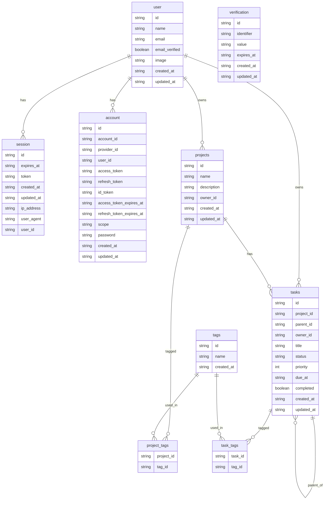

# Database

This project uses **Drizzle ORM** with **Neon Postgres** for a fully type-safe, serverless-ready database layer.

We follow a modular, relational structure:

- **Authentication layer** powered by **[Better Auth](https://www.better-auth.com/)**.
- **Project management layer** built on top with projects, tasks, and tags.

## Authentication Schema

The authentication tables (`user`, `session`, `account`, `verification`) are generated following the [Better Auth database schema](https://www.better-auth.com/docs/installation#create-database-tables).

This ensures full compatibility with Better Auth's authentication, session, and account management.

## Entity Relationship Diagram (ERD)

---

## Technology Stack

- 🗄 **Drizzle ORM**: A lightweight, type-safe ORM for SQL databases.
- 🏛 **Neon Postgres**: Serverless Postgres with branching and autoscaling.
- 🔐 **Better Auth**: Drop-in authentication provider with auto-generated database tables.
- 🛡 **Full Type Safety**: All tables, queries, and relationships are validated at compile-time.

---

## Table Summary

| Table          | Purpose                                                                 |
| :------------- | :---------------------------------------------------------------------- |
| `user`         | Better Auth user model. Stores account info.                            |
| `session`      | Better Auth session model. Tracks logins and expirations.               |
| `account`      | Better Auth linked accounts (e.g., OAuth, email-password).              |
| `verification` | Better Auth verifications for password reset, email confirmations, etc. |
| `projects`     | User-created projects.                                                  |
| `tasks`        | Tasks associated with projects, supporting hierarchy.                   |
| `tags`         | Tags that can be assigned to projects or tasks.                         |
| `project_tags` | Linking table for project–tag relationships.                            |
| `task_tags`    | Linking table for task–tag relationships.                               |

---

## Notes

- **Auth Tables**: Auto-generated by Better Auth; updated manually only for migration needs.
- **Cascade Deletes**: Enabled for tasks, project-tags, and task-tags.
- **Composite Keys**: `project_tags` and `task_tags` use composite primary keys.
- **UUIDs**: All user-created content (`projects`, `tasks`, `tags`) uses UUID primary keys for global uniqueness.
